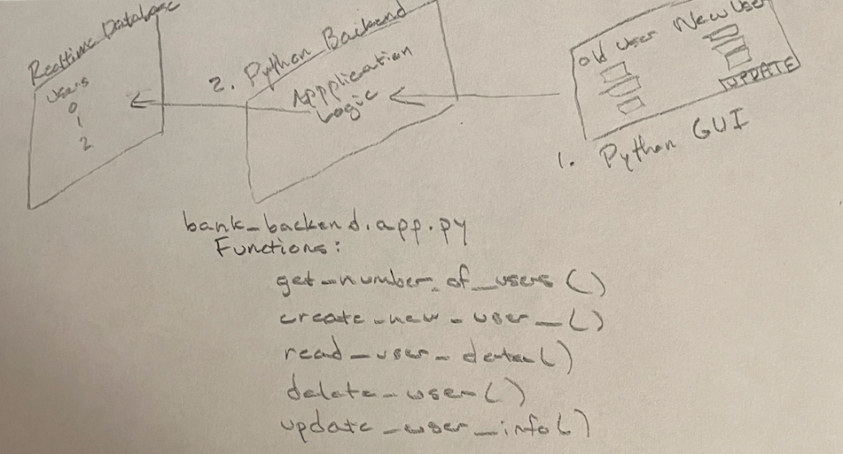
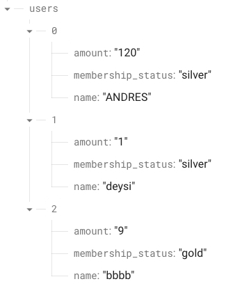
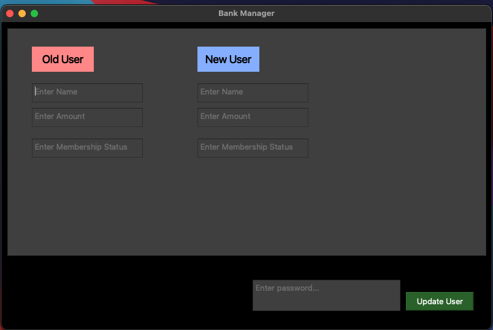
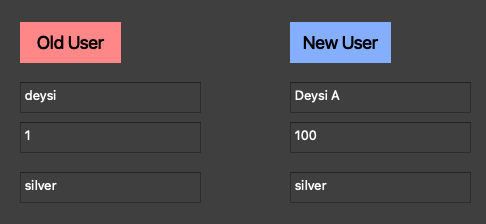
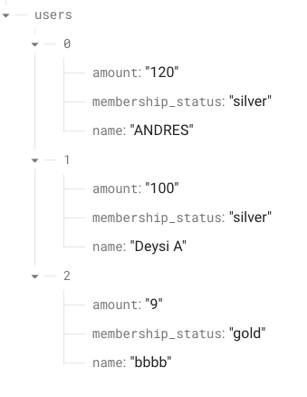

# Project Overview

## Firebase example data

## Python GUI

## Using the GUI to modify data
### 1.) Fill in data in the GUI

### 2.) Enter password and click **Update User**
### 3.) View changes in firebase

